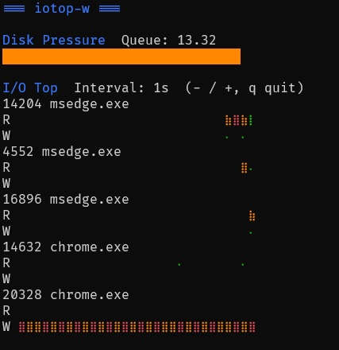

# iotop-w
iotop like command line application for Windows, written in Go. 

## Features

- Shows top individual processes consuming disk i/o (adjustable)
- Disk Pressure showing how much queue is on the system of processes awaiting
access slots to the storage
- Written in Go. App is self contained with no dependencies.
- Open Source MIT licence. 
- Two graph visualization modes ("braille" or monochrome sparkline blocks)a





## Commands

Use + and - keys to change the rate of display. Minimum is 100ms.  
Use "s" to toggle graph style.
There are some command line options:  

```
Usage: iotop-w [options]
Options:
--help, -h       Show this help message
--version, -v    Show version
--info, -i       Show repo info and license
--top <number>   Show top <number> processes (max 20, default 5).
```


## Requirements

- Windows 10 / 11
- Windows Terminal, or any ANSI-capable console (works in cmd)
- No admin required (admin shows more processes)

## Installation:

Just grab the binary from the releases section. Or:


* winget package manager (already built into Windows 11 and later builds of 10)

```posh
winget install iotop-w
```

* chocolatey (package manager suitable for Enterprise grade deployments, see http://www.chocolatey.org)

```posh
choco install iotop-w --version='1.0.3' -y
```

* scoop (dev and portable centric package manager in userspace, see https://scoop.sh/ ) 


```posh
scoop bucket add gsmitheidw https://github.com/gsmitheidw/scoop-gsmitheidw
scoop install iotop-w
```


## Explanation

I made this because there isn't anything else like this for Windows command line.  
There are plenty of process and memory "top" tools like btm but none of those
look at disk access as a potential bottleneck. On Linux there's iotop and iotop-c etc.
Because of how Windows provides access to the storage, a straight port of iotop isn't
at all straightforward. Sure you can look at task manager, but if you're remoting into
windows machines over ssh etc rather than RDP, this is a useful way to monitor disk.  


Is it "vibe coded"? Yes. Whilst I can code a bit for Sysadmin needs, I'm not a professional programmer. 
I have unashamedly used some ollama LLM to help me. It would have taken me months to make this otherwise. 


## Roadmap

Features that I'd like to include eventually:

[x] Publish in chocolatey community repo and possibly others
[ ] Theme colours, mono, for light backgrounds, high contrast etc
[x] The terminal process itself can be intrusive, might be nice to have option to exclude it


## Security

- No network access
- No registry access
- No file writes
- No elevation required (some processes may be inaccessible without elevation)

